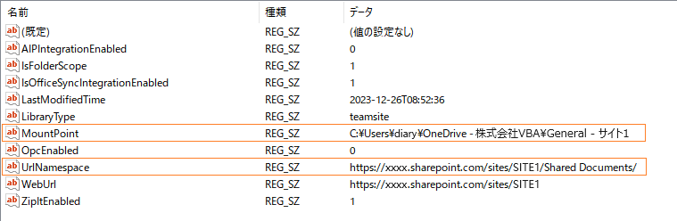

# GetLocalPath
# Convert the URL returned by Workbook.Path Property in Excel VBA on OneDrive to a local path.  
Created: December 29, 2023  
Last Updated: February 6, 2024  

## Problem to be solved  
  
There is a problem with the Workbook.Path property returning a URL pass when I run Excel VBA on OneDrive. It is not possible to get the local path of that book, and the URL pass is inconvenient, as the Dir function causes a runtime error and FileSystemObject cannot be used.  
  
Several methods have been proposed to solve this problem. For a personal OneDrive, there is a way to convert the URL path to a local path by processing the URL path as a string. For a personal OneDrive, the URL returned by the Workbook.Path property would be in the following format \<CID> is the 16-digit number assigned to the individual, followed by the path \<FOLDER-PATH> of the folder under the OneDrive.
```  
https://d.docs.live.net/<CID>/<FOLDER-PATH>
```  
At this time, the OneDrive local path can be converted as follows:  
```  
C:\Users\<USER-NAME>\OneDrive\<FOLDER-PATH>
```    
For personal OneDrive, the conversion to a local path is relatively easy. In OneDrive for Business, however, this URL path becomes more complex. Here is a typical example: 
```
https://<TENANT-NAME>.sharepoint.com/sites/<SITE-NAME>/Shared Documents/<FOLDER-PATH>
```
```    
https://<TENANT-NAME>-my.sharepoint.com/personal/<User-Principal-Name>/Documents/<FOLDER-PATH>
```  
When accessing the SharePoint or Teams document library, a menu of "Sync" and "Add Shortcut to OneDrive" will appear in the command bar.  
.png) 
  
Both are the same in that you can use Explorer to access SharePoint and Teams files, but the location of the folders is different. Sync" is added under the building icon, while "Add shortcut to OneDrive" is added under the cloud icon.  
(Assigning a SharePoint or Teams folder to OneDrive as a sync folder or shortcut folder is referred to here as "mounting.") 
   
The names of the folders to be mounted in this case will not be similar. Usually, "Sync" is a hyphenated combination of the site name and the folder name (site name on the left, folder name on the right). On the other hand, "Add shortcut to OneDrive" can be a folder name alone or a folder name and a site name joined by a hyphen (-) (folder name on the left, site name on the right).  
  
The local path is different as follows Sync" is the tenant name only, whereas "Add shortcut to OneDrive" is "OneDrive" followed by the tenant name.   

For "Sync":  
```
C:\Users\<USER-NAME>\<TENANT-NAME>\<FOLDER-PATH>
```  
For "Add Shortcut to OneDrive":  
```
C:\Users\<USER-NAME>\OneDrive - <TENANT-NAME>\<FOLDER-PATH>
```
  
In both cases, the <TENANT-NAME> contained in the LOCAL-PATH is usually different from the <TENANT-NAME> contained in the URL-PATH.
Furthermore, the <folder-path> contained in the locale-path does not necessarily match the <FOLDER-PATH> contained in the URL-path. The <FOLDER-PATH> in the URL path is an absolute path from the root of the document library while the <FOLDER-PATH> in the locale path is a relative path from the target folder of "Sync" or "Add Shortcut to OneDrive". The URL paths listed here are also local paths.  
Both URL paths and local paths listed here are only examples, and it is virtually impossible to convert a URL path to a local path by string conversion alone.  
    
## Proposed Solution  

### OneDrive mounting information
  
OneDrive mount information is located under the following registry key
```
\HKEY_CURRENT_USER\Software\SyncEngines\Providers\OneDrive
```
Under this registry key are the entries (subkeys) that are mounted in OneDrive. The hierarchical structure is shown in the following figure in the Registry Editor.  

  
    
Each entry is registered with a pair of UrlNameSpace and MountPoint.    

 
  
UrlNameSpace is the URL path to the SharePoint document library, and MountPoint is the local path under OneDrive. if there is an UrlNameSpace that matches the upper portion of the URL path returned by Workbook.Path the corresponding MountPoint for the UrlNameSpace can be found.
  
### Overview of conversion mechanism 
  
For example, assume the following case. 
```
UrlNameSpace ： https://xxxx.sharepoint.com/sites/SITE1/Shared Documents/  
MountPoint   ： c:\Users\diary\OneDrive - MyCompany\General - TestSite1  
Workbook.Path： https://xxxx.sharepoint.com/sites/SITE1/Shared Documents/General/folder1 
```
Since the UrlNameSpace matches the upper portion of the URL path returned by the Workbook.Path property, we can determine that the Workbook exists in or under the local path of MountPoint.
From the structure and notational relationship of the document library on the SharePoint site, we know that /General in the URL path returned by the Workbook.Path property corresponds to MountPoint's \General - TestSite1. 
Based on these, the URL path returned by Workbook.Path can be converted to the following local path
```
c:\Users\diary\OneDrive - MyCompany\General - TestSite1\folder1
```
  
## GetLocalPath Function

The GetLocalPath function converts URL paths to local paths using OneDrive mount information.
If the argument is a local path, it returns the local path as it is without conversion, so it can be used universally by replacing ThisWorkbook.Path in the code with GetLocalPath(ThisWorkbook.Path), for example.
Module_GetLocalPath.bas is an exported VBA module, which contains the Get "LocalPath function.
You can import Module_GetLocalPath.bas as is or copy and paste the necessary parts.  
  
### Syntax
GetLocalPath(UrlPath, [UseCache])  

|Part|Description|
----|----
|UrlPath|Required. String expression of URL path returned by Workbook.Path property.|
|UseCache|Optional, Boolean; Specify True to use the cache or False to not use the cache. The GetLocalPath function reads the OneDrive mount information from the registry and stores it in the cache (Static variable), which is used on the second and subsequent calls to the GetLocalPath function to speed up processing. The cache is valid until the Excel book of the VBA macro is closed. Regardless of the UseCache setting, if 30 seconds have elapsed since the last time the cache was read, the registry is read again and the cache is updated.|
|DebugMode|Optional, Boolean; if True, returns a cache (Collection type) of OneDrive mount information retrieved instead of the local path; if False, returns the local path. When omitted, the default value is False. This argument is used to parse the retrieved OneDrive information and is not normally used.|

### Return values

GetLocalPath returns a local path.

### Examples of Use
```
Dim localPath As String
localPath = GetLocalPath(ThisWorkbook.Path) 
```

### Module_GetLocalPath.bas Version
Created: December 29, 2023  
Last Updated: February 6, 2024  
Version: 1.004

## Known Issue
  
The local path shown by MountPoint contains only the name of a target folder under the document library on the SharePoint site. For example, if the name of a target folder is the same as that of an upper-level folder, the upper-level folder may be mistakenly identified as the target folder. This issue will not happen if there is a subordinate folder with the same name as the target folder. Now investigating a workaround for this issue.
  
## LICENSE
This code is available under the MIT License.
