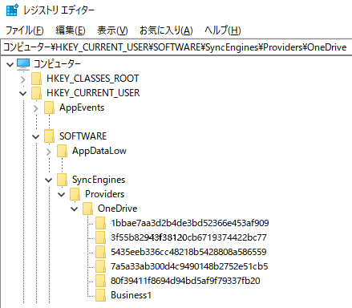

# GetLocalPath
# OneDrive上のExcel VBAでWorkbook.Pathプロパティが返すURLをローカルパスに変換する。  
#### README(en).md for English version    
最終更新日：2023年12月29日

## 解決したい問題  
  
OneDrive上のExcel VBAを動かすとWorkbook.Path プロパティがURLを返す問題が起きます。そのブックのローカルパスを取得できず、URLのままではDir関数が実行時エラーになったり、FileSystemObjectが使えなくなるなど不便な状態になります。  
  
この問題の解決にはいくつかの方法が提案されています。個人用OneDriveであればURLパスを文字列処理してローカルパスに変換する方法があります。
個人用OneDriveの場合、Workbook.Path プロパティが返すURLは次の形式となります。\<CID>は個人用に割り当てられた16桁の番号で、その後にOneDrive配下のフォルダのパス\<FOLDER-PATH>が続きます。  
```  
https://d.docs.live.net/<CID>/<FOLDER-PATH>
```  
この時、OneDriveのローカルパスは次のように変換できます。  
```  
C:\Users\<USER-NAME>\OneDrive\<FOLDER-PATH>
```    
個人用OneDriveの場合、ローカルパスへの変換は比較的容易です。しかし、OneDrive for Business においては、このURLパスが複雑になります。以下はその典型例です。  
```
https://<TENANT-NAME>.sharepoint.com/sites/<SITE-NAME>/Shared Documents/<FOLDER-PATH>
```
```    
https://<TENANT-NAME>-my.sharepoint.com/personal/<UPN>/Documents/<FOLDER-PATH>
```  
エクスプローラーを使ってSharePointやTeamsのファイルにアクセスする場合、「同期」と「OneDriveへのショートカットの追加」の二つの方法があります。生成されるローカルパスは次のとおりです。 
  
「同期」の場合：  
```
C:\Users\<USER-NAME>\<テナント名>\<フォルダーパス>
```  
「OneDriveへのショートカットの追加」の場合：  
```
C:\Users\<USER-NAME>\OneDrive - <テナント名>\<フォルダーパス>
```
  
「同期」と「OneDriveへのショートカットの追加」ではローカルパスの表記が微妙に異なります。また、ロカールパスに含まれる<テナント名>はURLパスに含まれる\<TENANT-NAME>とは異なります。さらにロカールパスに含まれる<フォルダーパス>は
URLパスに含まれる\<FOLDER-PATH>と必ずしも一致しません。ここに挙げたURLパスもローカルパスも一例に過ぎず、文字列変換だけでURLパスをローカルパスに変換するのは事実上無理です。  
  
## 提案する解決策 

### OneDriveのマウント情報
  
OneDriveのマウント情報は次のレジストキー配下にあります。
```
\HKEY_CURRENT_USER\Software\SyncEngines\Providers\OneDrive
```
このレジストリーキーの配下にはOneDriveにマウントされているエントリー（サブキー）が登録されています。レジストリーエディターで見ると下図のような階層構造になっています。
  
  
それぞれのエントリーにはUrlNameSpaceとMountPointが対になって登録されています。
 
  
UrlNameSpaceはSharePointのドキュメントライブラリーのURLパス、MountPointはOneDrive配下のローカルパスを示しています。Workbook.Pathが返すURLパスの上位部分と一致するUrlNameSpaceがあれば、そのUrlNameSpaceに対応するMountPointがわかります。
例えば、次のようなケースを想定します。
```
UrlNameSpace ： https://xxxx.sharepoint.com/sites/Test/Shared Documents/  
MountPoint   ： c:\Users\diary\OneDrive - MyCompany\General - Work  
Workbook.Path： https://xxxx.sharepoint.com/sites/Test/Shared Documents/General/folder1 
```
Workbook.Pathプロパティが返すURLパスの上位部分とUrlNameSpaceが一致していますので、MountPointのローカルパスまたはその配下にWorkbookが存在していると判断できます。
SharePoint サイトのドキュメントライブラリの構造から、Workbook.Pathプロパティが返すURLパスのうち /General は MountPoint の \General - Work に相当します。 
これらの関係から Workbook.Pathが返すURLパスはを次のローカルパスに変換できます。
```
c:\Users\diary\OneDrive - MyCompany\General - Work\folder1
```
### GetLocalPath 関数

OneDriveのマウント情報を使ってURLパスをローカルパスに変換する関数が「GetLocalPath関数」です。
Module_GetLocalPath.bas はVBAモジュールをエクスポートしたもので、この中にGet「LocalPath関数」が含まれています。Module_GetLocalPath.basをそのままインポートするか必要な部分をコピペしてお使いください。
#### 構文
GetLocalPath(UrlPath, [UseCache])  

|引き数|説明|
----|----
|UrlPath|必須。Workbook.Pathが返すURLパスを指定します。|
|UseCache|省略可。キャッシュを使う場合はTrue、使わない場合はFalseを指定います。省略時の規定値はTrueです。GetLocalPath関数はレジストリからOneDriveのマウント情報を読み込みキャッシュ（Static変数）に保存します。2回目以降のGetLocalPath関数呼び出し時にのキャッシュを使うことで処理を高速にしています。キャッシュはVBAマクロのExcelブックを閉じるまで有効です。前回のキャッシュ読み込みから30秒経過した場合は、UseCacheの指定にかかわらず、再度レジストリを読み込みキャッシュを更新します。|

#### 例
```
Dim localPath As String
localPath = GetLocalPath(ThisWorkbook.Path)
```


## 既知の問題
  
マウントポイント（MountPoint）は、SharePointサイトのフルパスではなくフィルダー名だけなので、マウントしたフォルダーが上位フォルダーと同一名の場合、誤って認識する場合があります。  


