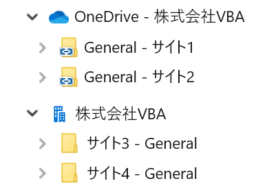
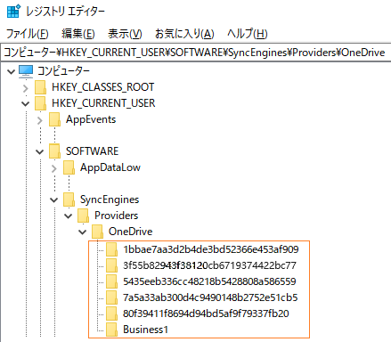

# GetLocalPath
# OneDriveでWorkbook.Pathプロパティ返すURLパスをローカルパスに変換する。（#Excel VBA #OneDrive）  
README(en).md for English version    
初回投稿日：2023年12月29日  
最終更新日：2024年2月6日

## 1. 解決したい問題  
  
OneDriveでExcel VBAを動かすとWorkbook.Path プロパティはローカルパスではなくURLパスを返すという問題が起きます。URLパスのままではDir関数が実行時エラーになったり、FileSystemObjectが使えなくなるなど不便な状態になります。  
  
この問題の解決にはいくつかの方法が提案されています。個人用OneDriveであればURLパスを文字列処理してローカルパスに変換する方法があります。
個人用OneDriveの場合、Workbook.Path プロパティが返すURLは次の形式となります。\<CID>は個人用に割り当てられた16桁の番号で、その後にOneDrive配下のフォルダーのパス\<FOLDER-PATH>が続きます。  
```  
https://d.docs.live.net/<CID>/<FOLDER-PATH>
```  
この時、OneDriveのローカルパスは次のように変換できます。  
```  
C:\Users\<USER-NAME>\OneDrive\<FOLDER-PATH>
```    
個人用OneDriveの場合、ローカルパスへの変換は比較的容易です。しかし、OneDrive for Business においては、このURLパスが複雑になります。以下はその典型例です。  
```
https://<TENANT-NAME>.sharepoint.com/sites/<SITE-NAME>/Shared Documents/<FOLDER-PATH>
```
```    
https://<TENANT-NAME>-my.sharepoint.com/personal/<User-Principal-Name>/Documents/<FOLDER-PATH>
```
SharePointやTeamsのドキュメントライブラリーにアクセスするとコマンドバーに「同期」と「OneDriveへのショートカットの追加」のメニューが表示されます。  
  
  
どちらもエクスプローラーを使ってSharePointやTeamsのファイルにアクセスできる点では同じですが、フォルダーの置き場所は異なります。「同期」は建物アイコンの下に、「OneDriveへのショートカットの追加」は雲アイコンの下に追加されます。  
（SharePointやTeamsのフォルダーをOneDriveに同期フォルダーまたはショートカットフォルダーとして割り当てることをここでは「マウント」と呼ぶことにします。）
  
  
  
このときマウントされるフォルダーの名前は似て非なるものになります。通常、「同期」はサイト名とフォルダー名をハイフン（-）で連結した名前になります（サイト名が左でフォルダー名が右）。一方「OneDriveへのショートカットの追加」はフォルダー名だけの単独か、フォルダー名とサイト名をハイフン（-）で連結した名前になります（フォルダー名が左でサイト名が右）。  
  
またローカルパスは次のとおり異なります。「同期」はテナント名だけなのに対して、 「OneDriveへのショートカットの追加」は"OneDrive"とテナント名を連結したものになります。
  
「同期」の場合：  
```
C:\Users\<USER-NAME>\<テナント名>\<フォルダーパス>
```  
「OneDriveへのショートカットの追加」の場合：  
```
C:\Users\<USER-NAME>\OneDrive - <テナント名>\<フォルダーパス>
```
  
どちらの場合も、通常、ローカルパスに含まれる<テナント名>はURLパスに含まれる\<TENANT-NAME>とは異なります。  
さらにロカールパスに含まれる<フォルダーパス>はURLパスに含まれる\<FOLDER-PATH>と必ずしも一致しません。ロカールパスに含まれる<フォルダーパス>は「同期」または「OneDriveへのショートカットの追加」の対象となるフォルダを起点とする相対パスであるのに対して、URLパスに含まれる\<FOLDER-PATH>はドキュメントライブラリーのルートからの絶対パスになります。  
ここに挙げたURLパスもローカルパスも一例に過ぎず、文字列変換だけでURLパスをローカルパスに変換するのは事実上無理です。  
  
## 2. 提案する解決策 

### OneDriveのマウント情報  
  
OneDriveのマウント情報は次のレジストキー配下にあります。
```
\HKEY_CURRENT_USER\Software\SyncEngines\Providers\OneDrive
```
このレジストリーキーの配下にはOneDriveにマウントされているエントリー（サブキー）が登録されています。レジストリーエディターで見ると下図のような階層構造になっています。  

  
    
それぞれのエントリーにはUrlNameSpaceとMountPointが対になって登録されています。  
次の図はその例です。

 
  
UrlNameSpaceはSharePointのドキュメントライブラリーのURLパス、MountPointはOneDrive配下のローカルパスを示しています。Workbook.Pathが返すURLパスの上位部分と一致するUrlNameSpaceがあれば、そのUrlNameSpaceに対応するMountPointがわかります。

さらにOneDriveの設定情報は次のローカルパスにあります。  
```
C:\Users\<USER-NAME>\AppData\Local\Microsoft\OneDrive\Settings
```
WindowsやOneDriveの環境によりますが、この配下にはBusiness1、Business2、Personal という三つのフォルダーがあります。  
このフォルダーにある「global.ini」ファイルを手掛かりに関連するINIファイルを調べてOneDriveのマウント情報を補完します。  
  
### 変換メカニズムの概略 
 
例えば、次のようなケースを想定します。ここでは「OneDriveへのショートカットの追加」のケースを示しています。
```
Workbook.Path： https://xxxx.sharepoint.com/sites/SITE1/Shared Documents/General/SubFolder1
UrlNamespace ： https://xxxx.sharepoint.com/sites/SITE1/Shared Documents/ 
MountPoint   ： c:\Users\diary\OneDrive - 株式会社VBA\General - サイト1 
```
Workbook.Pathプロパティが返すURLパスの上位部分とUrlNameSpaceが一致していますので、MountPointのローカルパスまたはその配下にWorkbookが存在していると判断できます。
SharePoint サイトのドキュメントライブラリの階層構造とフォルダーの命名規則の関係から、Workbook.Pathプロパティが返すURLパスのうち「/General」が MountPoint の「\General - サイト1」に相当します。 
これらのことを踏まえ、Workbook.Pathが返すURLパスは次のローカルパスに変換できます。
```
c:\Users\diary\OneDrive - 株式会社VBA\General - サイト1\SubFolder1
```
  
## 3. GetLocalPath 関数

OneDriveのマウント情報を使ってURLパスをローカルパスに変換する関数が「GetLocalPath関数」です。
引き数がローカルパスの場合は、変換せずにローカルパスをそのまま返しますので、例えば、コードの中の ThisWorkbook.Path を GetLocalPath(ThisWorkbook.Path) に置き換えて汎用的に使うことができます。
Module_GetLocalPath.bas はVBAモジュールをエクスポートしたものです。この中に「GetLocalPath関数」が含まれています。Module_GetLocalPath.basをそのままインポートするか必要な部分をコピペしてお使いください。
  
### 構文
GetLocalPath(UrlPath, [UseCache])  

|引き数|説明|
----|----
|UrlPath|必須。String型。Workbook.Pathが返すURLパス（文字列）を指定します。|
|UseCache|省略可。Boolean型。キャッシュを使う場合はTrue、使わない場合はFalseを指定します。省略時の規定値はTrueです。GetLocalPath関数はレジストリからOneDriveのマウント情報を読み込みキャッシュ（Static変数）に保存します。2回目以降のGetLocalPath関数呼び出し時に、このキャッシュを使うことで処理を高速化しています。キャッシュはVBAマクロのExcelブックを閉じるまで有効です。UseCacheの指定にかかわらず、前回のキャッシュ読み込みから30秒経過した場合は再度レジストリを読み込みキャッシュを更新します。|

### 戻り値

GetLocalPath関数はローカルパスを文字列で返します。
  
### 例
```
Dim localPath As String
localPath = GetLocalPath(ThisWorkbook.Path)
```
### Module_GetLocalPath.bas バージョン
Created: December 29, 2023  
Last Updated: January 12, 2024  
Version: 1.003  
  
## 4. 既知の問題

### (1) OneDriveにマウントしたフォルダー名と同一の上位フォルダーが存在する場合    
MountPointで示されるローカルパスには、SharePointサイトのドキュメントライブラリー配下にある、特定のフィルダーの名前だけの情報しかありません。ドキュメントライブラリーのルートからのフルパスを示していませんので、そのフォルダーがドキュメントライブラリーの階層構造のどの位置のどのフォルダーに該当するかを突きとめる必要が出てきます。このとき、該当フォルダーの名前が上位フォルダーと同一名の場合、上位フォルダーを当該フォルダーだと誤って認識する場合があります。ただし、この事象は「OneDriveへのショートカットの追加」でマウントした場合や当該フォルダーと同じ名前のフォルダーが下位にある場合は起きません。「同期」でマウントした場合のみの事象です。この事象を回避するための方法は現在調査中です。

### (2) 「OneDriveへのショートカットの追加」でマウントした後にフォルダー名を変更したり移動した場合  
「OneDriveへのショートカットの追加」でマウントした後にフォルダー名を変更したりフォルダーを移動することは可能です。しかし、この変更は直ちにレジストリに反映されないため、レジストリに登録されているMountPointとOneDriveの実際のフォルダー名は一致しなくなります。このためMountPointで示されるフォルダーが存在しないと判定され、GetLocalPath関数はヌル文字（長さ0の文字列）を返します。  
「OneDriveへのショートカットの追加」でマウントした後にフォルダー名を変更したりフォルダーを移動した場合はWindowsを再起動してください。    

## 5. ライセンス
  
このコードはMITライセンスに基づき利用できます。  
  
